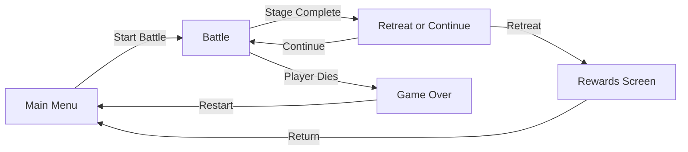
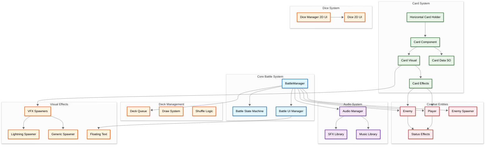
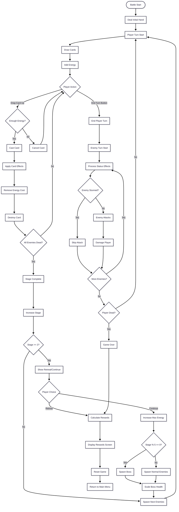
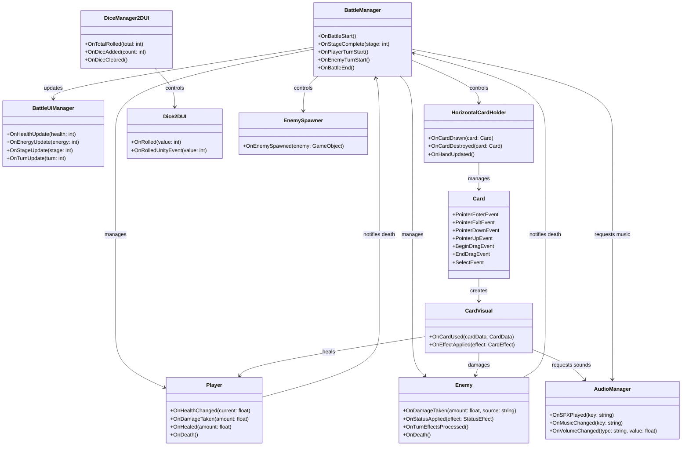

## Developer & Contributions
**Alerica** (Game Designer & Artist)  
**adxze** (Game Programmer & Artist)  
**Albert** (Game programmer & Artist)

## About
Greed Dungeon is a strategic deck building roguelike where players battle through increasingly difficult stages using a deck of powerful cards. Manage your energy, build devastating combos, and survive against waves of enemies with unique status effects. Choose between retreating with your rewards or pushing deeper into the dungeon for greater treasures. Every decision matters as you balance risk and reward in this challenging turn-based adventure.

 

## Key Features

**Strategic Card Combat**: Deploy cards from your hand by dragging them to the battlefield. Each card costs energy and unleashes powerful effects, from direct damage to debilitating status effects like Burn, Stun, Frost, and Bleed.

**Progressive Difficulty**: Face increasingly powerful enemies as you advance through stages. Every 5 stages features a boss battle with enhanced health and abilities. Decide when to retreat and claim your rewards or push forward for greater glory.

**Risk Management**: Players have the option to continue or go back and claim the reward, if the player dies they will not get anything.

<table>
<tr>
<td align="center" width="50%">

</td>
<td align="center" width="50%">

</td>
</tr>
</table>

## Scene Flow

## Layer / Module Design

## Modules and Features

The strategic card-based roguelike gameplay with turn-based combat, deck management, status effects, and progressive difficulty is powered by a comprehensive Unity C# scripting system.

| 📂 Name | 🎬 Scene | 📋 Responsibility |
|---------|----------|-------------------|
| **Battle System** | **Battle** | - Control overall battle state machine (NotStarted, PlayerTurn, EnemyTurn) - Manage turn flow and stage progression - Handle energy system (gain 3 per turn, max increases per stage) - Queue and shuffle deck with draw mechanics - Calculate rewards and difficulty scaling (1.04x health per stage) - Trigger retreat/continue decisions every 2+ stages |
| **Card System** | **Battle** | - Handle 3D card visuals with drag-and-drop interactions - Animate cards with curve positioning, tilt, and scale effects - Process card usage when dragged to top half of screen - Display card data (name, cost, description, artwork) - Apply card effects to random enemies - Manage hand layout with swap animations - Draw cards from deck and destroy after use |
| **Combat Entities** | **Battle** | - Track player/enemy health, attack, and defense - Process damage with defense reduction formula: `damage × (100/(100+defense))` - Apply and manage status effects (Burn, Stun, Frost, Bleed, etc.) - Execute turn-based effect processing - Spawn enemies with scaling health (boss every 5 stages) - Handle death and victory conditions |
| **Dice System** | **Battle** | - Manage collection of 2D dice with dynamic add/remove - Animate dice rolling with spin sprites and jump arcs - Roll all dice in wave pattern with delays - Calculate and report total results via callbacks - Play dice roll sound effects - Support auto-destroy after rolling |
| **Audio System** | **Persistent** | - Manage SFX and music libraries with volume control - Pool audio sources for efficient playback - Crossfade between music tracks - Support pitch randomization for variety - Persist across scene loads with DontDestroyOnLoad - Handle WebGL audio unlock |
| **Visual Effects** | **Battle** | - Display turn banners (Player Turn, Enemy Turn, Battle Start) - Show status effect notifications with colors - Spawn floating damage/heal numbers - Animate enemy attack jumps - Cast card VFX (Lightning, Generic effects) - Animate background transitions on stage completion |
| **UI Management** | **Battle** | - Update player health, energy, and stats display - Show current turn and stage numbers - Display enemy count and deck size - Spawn floating text for damage/heal/energy changes - Control battle UI panel visibility - Manage choice panels (retreat/continue) |

 

## Game Flow Chart

 

## Event Signal Diagram

 

## Controls
- **Left Click & Drag** - Drag card from hand
- **Drag to Top Half** - Cast card (if enough energy)
- **Hover Card** - Show enlarged preview
- **Hold Hover 2s** - Display card description tooltip
- **Right Click** - Deselect all cards
- **End Turn Button** - End player turn manually

## Progression System
- Stages increase in difficulty
- Enemy health scales: `baseHealth × 1.04^(stage-1)`
- Every 5 stages: Boss battle
- Every 2 stages: Choice to retreat or continue
- Retreating awards points based on:
  - Base points: 10
  - Enemy defeats: `(80 + stage×3) × enemiesDefeated`
  - Boss defeats: `1000 × bossesDefeated`
  - Stage bonus: `basePoints + stage×5×stage`
